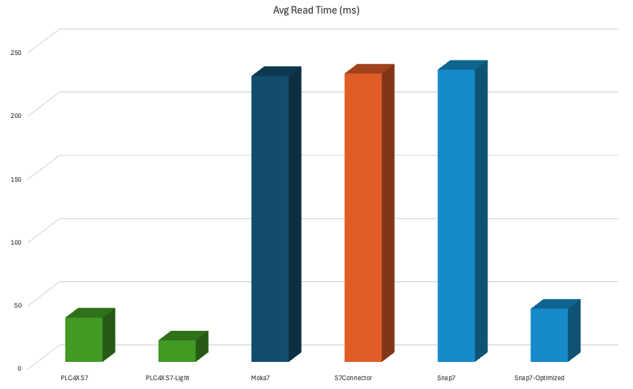

# Benchmarks

In this project, we try to run read requests with an identical set of tags against the same instance of a PLC and measure the time required for connecting, reading and disconnecting. 
For read request, we run a number of read operations in timed cycles and measure the average time needed to execute the operations.

## Java

Summary of the Java-Based libraries that are available.

### PLC4X

This is the baseline implementation the other libraries `compete` against.

Here we have implemented two variants of drivers. 
Therefore, there are also two test results.

#### S7

This is the normal implementation of the S7 protocol, but able to also provide additional functionality when communicating with `S7-300` and `S7-400` devices.

This implementation uses the initial optimizer, that groups together tags into multi-item-requests, based on the maximum PDU size, that was negotiated during the connection process.

#### S7-Light

This is a new implementation, that is stripped down in order to avoid some of the issues the more complex communication usually causes.

In addition, the `s7-light` driver uses a different optimizer per default.
This optimizer automatically groups together tags in proximity in the PLC memory, resulting in much more optimized access speeds.

### Moka7

Moka7 only seems to support single-item reads.

No real built-in support for more complex types such as Float, Double, temporal values etc., so the integration module needed to implement all of that.

### S7Connector

As with Moka7, the S7Connector also only seems to support single-item reads.

No real built-in support for more complex types such as Float, Double, temporal values etc., so the integration module needed to implement all of that.

## Cpp

### Snap7

Snap7 generally supports multi-item reads.

However, its implementation seems to use a hard-coded limit of 20 tags.

This seems odd, as the number of tags a driver is able to read in one request, depends on the negotiated PDU size as well as what data the tag references.

It seems Snap7 doesn't support any of the 64-bit types such as LWORD, LINT, ULINT, LREAL, ...

Also, it does not support the 16-bit character types WCHAR and WSTRING

Therefore, the benchmark code needs to handle both the correct grouping of tags in multi-item requests as well as the handling of previously unsupported datatypes.

Here we also have two benchmark implementations:

#### Snap7

This simply uses single-item requests, which simplifies the usage of the library, but comes at performance costs.

#### Snap7 Optimized

In this implementation, we utilize the multi-item requests features of the Snap7 library, but take care of calculating the grouping ourselves.

## Results

````
Scenario: 19 tags, 50 cycles, 300ms intervals
````


| Driver         | Connection Speed (ms) | Disconnect Speed (ms) | Avg Read Speed (ms) | Multi-Item Requests     | Datatypes |
|----------------|-----------------------|-----------------------|---------------------|-------------------------|-----------|
| PLC4J S7       | 78                    | 2                     | 35                  | true                    | all       |
| PLC4J S7-Light | 81                    | 2008                  | 17                  | true                    | all       |
| Moka7          | 73                    | 0                     | 226                 | false                   | some      |
| S7Connector    | 79                    | 0                     | 228                 | false                   | some      |
| Snap7          | 62                    | 0                     | 231                 | false                   | some      |
| Snap7 Opt.     | 83                    | 0                     | 42                  | true (manual splitting) | some      |

### PLC4J S7

````
Running: 'PLC4X S7'
  --> 78 ms connect, 2 ms disconnect, 35 ms avg read time
````

### PLC4J S7-Light

````
Running: 'PLC4X S7-Light'
  --> 81 ms connect, 2008 ms disconnect, 17 ms avg read time
````

### Moka7

````
Running: 'Moka7'
  --> 73 ms connect, 0 ms disconnect, 226 ms avg read time
````

### S7Connector

````
Running: 'S7Connector'
  --> 79 ms connect, 0 ms disconnect, 228 ms avg read time
````

### Snap7

````
Running: 'Snap7'
  --> 62 ms connect, 0 ms disconnect, 231 ms avg read time
````

### Snap7 Optimized

````
Running: 'Snap7-Optimized'
  --> 83 ms connect, 0 ms disconnect, 42 ms avg read time
````
